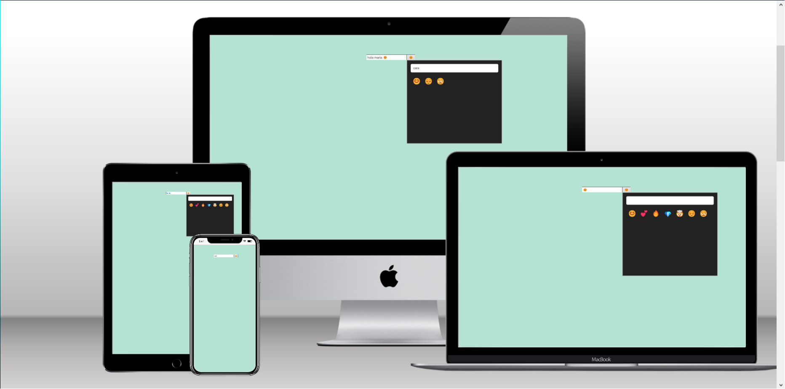

# Kruger Start Emoji Picker

 > Este es un proyecto que sirve para aprender a usar useRef en react mediante una aplicacion de selección de emojis.

## Build with 

 - JS
 - React
 - Netlify
 - HTML CSS

## Live Demo

 [Live Demo Link](https://incredible-snickerdoodle-da486b.netlify.app)

## Run it Locally

 ### Setup
 
  -Clone this repo using `git clone https://github.com/Alex-Junior-Solorzano/Emoji`

 ### Comands
  - 'npm i'
  - 'npm start'

## Autor

 👤 **Alex Junior Solorzano**

 - GitHub: [@Alex-Junior-Solorzano](https://github.com/Alex-Junior-Solorzano)

## Acknowledgments

 - [@vidamrr](https://www.youtube.com/@vidamrr)
